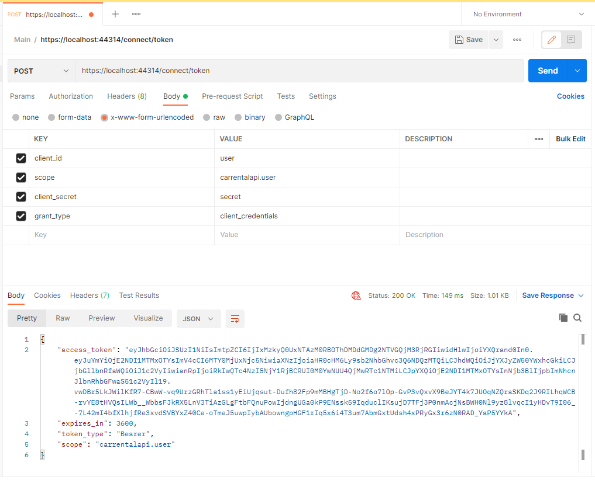

# Prerequisites
 - [DotNet 5](https://dotnet.microsoft.com/en-us/download/dotnet/5.0) (should be available with deafult VS 19 installation)
 - [SQL Server Developer Edition 2019](https://go.microsoft.com/fwlink/?linkid=866662)

 # How to Run Solution
 ## Create Database from Entity Framework Migrations
 Open Visual Studio and Run command inside `Package Manager Console`:
```ps
Update-Database
```


## Run solution
Press `F5` inside visual studio, Swagger should open automatically


# How to add new migrations
 Open Visual Studio and Run command inside `Package Manager Console`:
 ```ps
 Add-Migration <migrationName> -StartupProject CarRentalApi.WebApi -Project CarRentalAPi.Services
 ```


And run again 
```ps
Update-Database
```

# How to add secrets to project
Open Visual Studio and right-click on given project and select  `Manage user secrets`. For `IdentityServer` project set `userClientId`, `workerClientId`, `userPassword`, `workerPassword` to given password and `introspectionSecret` for introspection endpoint. In production we get these values from Azure Keyvault.
```json
{
    "userClientId": "user",
    "userPassword":  "secret",
    "workerClientId": "worker",
    "workerPassword":  "secret",
    "introspectionEndpoint":  "secret"
}
```
## Example request for token


Also add to the `WebApi` project the following secrets with the same value as above:
```json
{
    "userClientId": "user",
    "userPassword":  "secret",
    "workerClientId": "worker",
    "workerPassword":  "secret",
    "blobConnectionString": "secret"
}
```

For testing run multiple startup projects in Visual Studio: `WebApi` and `IdentityServer`.